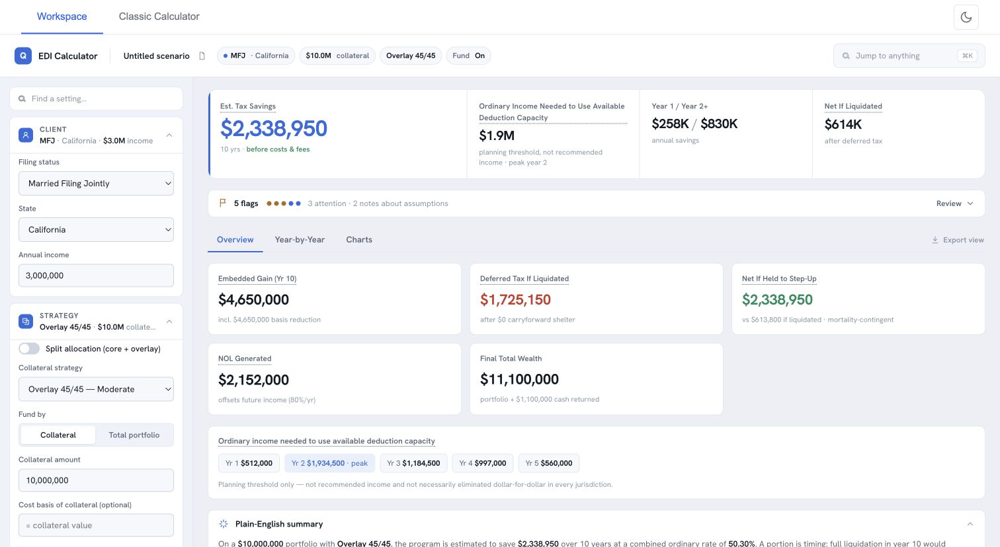

# Enhanced Direct Indexing Calculator

A React + TypeScript calculator for financial advisors to model the tax impact of pairing
enhanced direct indexing (long/short tax-loss harvesting) with the extension fund for ultra-high-net-worth qualified purchasers. It projects
year-by-year tax savings, carryforward balances, and liquidation/estate outcomes from a
single calculation engine.



[Try the live demo](https://houseoftyrell.github.io/EnhancedDirectIndexingCalc/)

## The two tabs

- **Workspace** (default) — single-screen experience: a persistent input rail (client,
  strategy, carryforwards, the fund, deleveraging, model toggles, per-year events, actions)
  beside a results-first pane with a headline metric strip and Overview / Year-by-Year /
  Charts sub-views. Fund by collateral amount or by total portfolio budget (the tool
  solves collateral + fund = total). Meeting Mode, Excel export, and CSV scenario
  import/export launch from the Actions group.
- **Classic Calculator** — the full-detail legacy view. Split allocation (Core cash leg +
  Overlay appreciated-stock leg), sensitivity analysis, and year-by-year planning panels
  deliberately live here.

A hidden test planner is reachable via `Ctrl+Shift+Q`.

## Key modeling capabilities

- **Fund mechanics** — 150% ST gains / 150% ordinary losses (configurable multiplier),
  auto-sizing against the collateral's harvested ST losses, fixed or dynamic (yearly
  resize) modes, sizing window/cushion, duration with breakeven unwind, optional
  redeployment of redemptions into the core.
- **Federal tax rules** — 2026 brackets and LTCG thresholds (Rev. Proc. 2025-32), §461(l)
  excess-business-loss limits ($256K/$512K) modeled precisely with NOL spillover, NOL 80%
  offset limit, §1211(b) capital-loss limits ($3K/$1.5K MFS), NIIT placement (excluded
  from the value of ordinary deductions per §1411).
- **Per-state tax engine** — character-specific profiles for CA (incl. SB 167 NOL
  suspension), NY (incl. optional NYC resident tax), PA/NJ (no loss offset against wages,
  gains still taxed), MA (split ST/LT rates), WA (LTCG excise + surcharge tier); flat
  conformity for other states.
- **Exit-tax / embedded-gain analysis** — basis reduction from harvesting, optional
  collateral cost basis for concentrated stock, carryforward shelter at exit, signed
  incremental deferred tax vs. a passive baseline, and a hold-to-step-up estate comparison.
- **EDI-only mode** — with the fund off, the Workspace becomes a first-class EDI-only
  view: realized savings plus a co-equal "loss reserve built" headline (contingent
  carryforward shelter value, never added to realized savings), protection ratio, and
  break-even gain event.
- **Deleveraging glide path** — unwind the extension to long-only (or a lower-leverage
  strategy) all at once or over a glide, with defensible-default unwind-gain character,
  short-cover, and lot-selection assumptions, all overridable.
- **Per-year events and schedules** — income overrides and an income schedule builder,
  cash infusions, planned capital-gain events (sheltered event-last), scenario presets
  (business sale / RSU vesting / concentrated stock), and an NOL run-until-used
  projection extension.
- **Meeting Mode** — full-screen client presentation with a compliance disclosure block
  and a 3-sheet print handout.
- **CSV / Excel** — scenario inputs round-trip through CSV; full results export to Excel.

## Quick start

```bash
npm install
npm run dev        # Vite dev server (http://localhost:5173)
npm run test:run   # vitest suite (352 tests)
npm run build      # tsc type-check + vite build (single-file HTML output)
```

Node 20.19+ (or 22.12+) is required by Vite 7. `npm run lint` / `npm run format` cover
ESLint and Prettier.

## Project layout

```
src/
├── calculations/        # The engine (see docs/ARCHITECTURE.md)
│   ├── core.ts          # calculate() / calculateWithOverrides() — the one projection loop
│   ├── helpers.ts       # §1211/§1212 netting, $3K, NOL ordering, summary
│   ├── sizing.ts        # Fund auto-sizing + total-budget solver
│   ├── splitAllocation.ts, deleverage.ts, financing.ts
│   ├── exitTax.ts, ediInsights.ts, sensitivity.ts, lossBreakdown.ts
│   └── index.ts         # Public surface (see docs/API.md)
├── workspace/           # Workspace tab (primary UI)
├── components/          # Shared UI incl. MeetingMode/
├── AdvancedMode/        # Classic-tab planning panels
├── taxData.ts           # 2026 federal brackets + state profiles
├── strategyData.ts      # 10 strategies (5 Core, 5 Overlay) + constants
└── popupContent.ts      # Tooltip/help entries for every visible metric
```

- `docs/DECISIONS.md` — the product decision log (D-001…D-018 + owner directives).
  Binding source of truth for all future work.
- `docs/reviews/` — historical point-in-time analyses; `docs/plans/` — past plans.
- **Baseline (D-001):** the pre-improvement version is frozen at the
  `baseline-2026-06-11` branch (commit `b6a8d4e`); `TaxOptimizationCalculator.html` in
  the repo root is its pre-built distributable. Compare with
  `git diff origin/baseline-2026-06-11..HEAD`. No work is committed directly to `main`.

## Disclaimers

This is an advisor-internal educational tool producing **estimates, not tax or
investment advice**. Headline savings are **gross by default** (D-002): financing fees,
wash-sale haircuts, present-value discounting, and other complexity are opt-in layers,
shown with explicit labeling while disabled. The fund's tax treatment is contingent on
qualification; AMT, §1092 straddles, and §469 are not modeled (disclosed in-app). Clients
should consult their own tax advisors.
